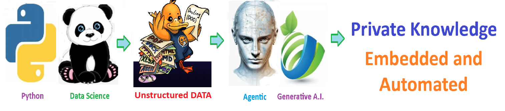

    
# Docling 

## Utilize docling to build a knowledge base out of ANY document so an AI LLM query the data

    

## 🧠 Docling - Consume your documents and Leverage YOUR Private Knowledge

The solution **consumes existing unstructured documents** and accelerate the development of AI-driven solutions.

Docling simplifies document processing, parsing diverse formats — including advanced PDF understanding — and providing seamless integrations with the gen AI ecosystem.

This solutions allows you to consume ANY Critical knowledge to be able to **enlighten your enterprise**.

- 🧩 Docling - Documents to Knowledge
- 📫 Created by ThriveAI ... Joe Eberle
- 🗓️ Started: April 18, 2025  Contact: josepheberle@outlook.com
- 🔗 GitHub: JoeEberle
- 🖇️ Contact: josepheberle@outlook.com

## 🧠 Transform Your Documents
 
**Docling** turns messy PDFs, DOCX, and slides into clean, structured data—ready for RAG, GenAI apps, or anything downstream. 
Complex layouts? Tables? Formulas? It handles them, so you don’t have to.

#### 1. **Advanced Document Parsing** - Extracts clean structure from messy PDFs, DOCs, HTML, and more.
#### 2. **GenAI-Ready Integration** - Plugs into LangChain, LlamaIndex, and other popular AI frameworks.
#### 3. **Structured Output** - Delivers chunked, labeled data optimized for LLM pipelines..

## 🧠 Transform Your Documents
 
**Docling** turns messy PDFs, DOCX, and slides into clean, structured data—ready for RAG, GenAI apps, or anything downstream. 
Complex layouts? Tables? Formulas? It handles them, so you don’t have to.

#### 1. **Advanced Document Parsing** - Extracts clean structure from messy PDFs, DOCs, HTML, and more.
#### 2. **GenAI-Ready Integration** - Plugs into LangChain, LlamaIndex, and other popular AI frameworks.
#### 3. **Structured Output** - Delivers chunked, labeled data optimized for LLM pipelines..

Welcome to the solution **Docling** 

Utilize docling to build a knowledge base out of ANY document so an AI LLM query the data

 

## 🧠 Docling - Consume your documents and Leverage YOUR Private Knowledge

The solution **consumes existing unstructured documents** and accelerate the development of AI-driven solutions.

Docling simplifies document processing, parsing diverse formats — including advanced PDF understanding — and providing seamless integrations with the gen AI ecosystem.

This solutions allows you to consume ANY Critical knowledge to be able to **enlighten your enterprise**.

- 🧩 Docling - Documents to Knowledge
- 📫 Created by ThriveAI ... Joe Eberle
- 🗓️ Started: April 18, 2025  Contact: josepheberle@outlook.com
- 🔗 GitHub: JoeEberle
- 🖇️ Contact: josepheberle@outlook.com

## 🧠 Transform Your Documents
 
**Docling** turns messy PDFs, DOCX, and slides into clean, structured data—ready for RAG, GenAI apps, or anything downstream. 
Complex layouts? Tables? Formulas? It handles them, so you don’t have to.

#### 1. **Advanced Document Parsing** - Extracts clean structure from messy PDFs, DOCs, HTML, and more.
#### 2. **GenAI-Ready Integration** - Plugs into LangChain, LlamaIndex, and other popular AI frameworks.
#### 3. **Structured Output** - Delivers chunked, labeled data optimized for LLM pipelines..

## 🧠 Transform Your Documents
 
**Docling** turns messy PDFs, DOCX, and slides into clean, structured data—ready for RAG, GenAI apps, or anything downstream. 
Complex layouts? Tables? Formulas? It handles them, so you don’t have to.

#### 1. **Advanced Document Parsing** - Extracts clean structure from messy PDFs, DOCs, HTML, and more.
#### 2. **GenAI-Ready Integration** - Plugs into LangChain, LlamaIndex, and other popular AI frameworks.
#### 3. **Structured Output** - Delivers chunked, labeled data optimized for LLM pipelines..

 

## Getting Started

The goal of this solution is to **Jump Start** your development and have you up and running in 30 minutes. 

To get started with the **Docling** solution repository, follow these steps:
1. Clone the repository to your local machine.
2. Install the required dependencies listed at the top of the notebook.
3. Explore the example code provided in the repository and experiment.
4. Run the notebook and make it your own - **EASY !**
    
## 🧠 Solution Features

- ✅ Easy to understand and use  
- ✅ Easily Configurable 
- ✅ Quickly start your project with pre-built templates
- ✅ Its Fast and Automated
- ✅ Saves You Time 

## ⚙️ Key Features

- ✅ **Self Documenting** Automatically identifies and annotates major steps in a notebook, making the codebase readable and well structured.
- ✅ **Self Testing** Includes built in **unit tests** for each function to validate logic and ensure code reliability.
- ✅ **Easily Configurable** Uses a simple **config.ini** file for centralized settings and easy customization through key value pairs.
- ✅ **Talking Code** explains itself through inline commentary, helping you understand both **what** it does and **why** it does it.
- ✅ **Self Logging** extends Python’s standard **logging** module for **step by step runtime insights**.
- ✅ **Self Debugging** Includes debugging hooks and detailed error tracing to simplify development and troubleshooting.
- ✅ **Low Code or  No Code** Designed to minimize complexity — most full solutions are under 50 lines of code.
- ✅ **Educational** Each template includes educational narrative and background context to support learning, teaching, and collaborative development.

    